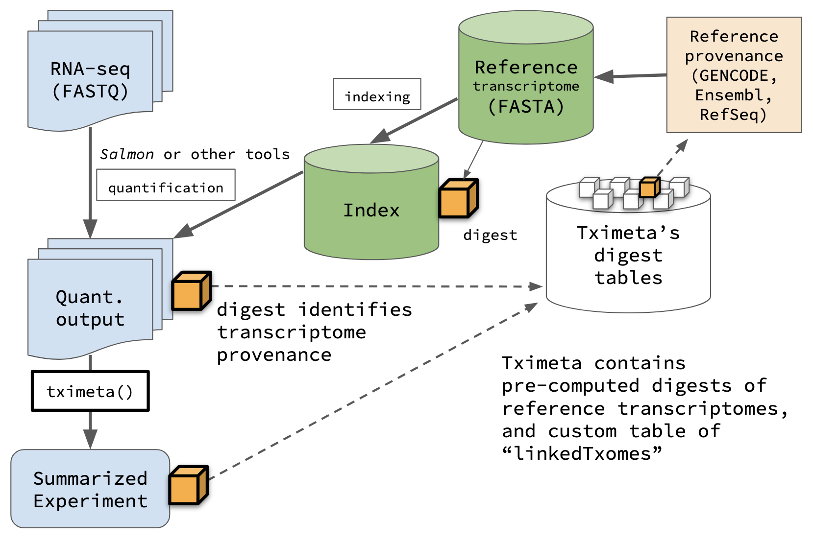

# tximeta 

# Automatic metadata for RNA-seq

*tximeta* provides a set of functions for conveniently working with
metadata for transcript quantification data in Bioconductor. The
`tximeta()` function imports quantification data from *Salmon* or
other quantifiers, and returns a 
[SummarizedExperiment](https://bioconductor.org/packages/release/bioc/vignettes/SummarizedExperiment/inst/doc/SummarizedExperiment.html#anatomy-of-a-summarizedexperiment)
object.

If `tximeta()` recognizes the reference transcripts used
for quantification, it will automatically download relevant
information about the location of the transcripts in the correct genome.
*These actions happen in the background without requiring any extra
effort or information from the user.*

This metadata is attached to the *SummarizedExperiment* in the
`metadata()` and `rowRanges()` slots.

For a list of the reference transcriptomes supported by `tximeta()`,
see the "Pre-computed checksums" section of the vignette in the 
`Get started` tab.

Further steps are also facilitated, e.g. `summarizeToGene()`, `addIds()`,
or even `retrieveCDNA()` (the transcripts used for quantification) or
`retrieveDb()` (the correct *TxDb* or *EnsDb* to match the
quantification data).

# How it works

The key idea behind *tximeta* is that *Salmon* propagates a hash value
summarizing the reference transcripts into each quantification
directory it outputs. *tximeta* can be used with other tools as long
as the 
[hash of the transcripts](https://github.com/COMBINE-lab/FastaDigest) 
is also included in the output directories. 

# Reference

A reference for *tximeta* package is:

> Michael I. Love, Charlotte Soneson, Peter F. Hickey, Lisa K. Johnson,
> N. Tessa Pierce, Lori Shepherd, Martin Morgan, Rob Patro.
> "Tximeta: reference sequence checksums for provenance
> identification in RNA-seq" *PLOS Computational Biology* (2020)
> [doi: 10.1371/journal.pcbi.1007664](https://doi.org/10.1371/journal.pcbi.1007664)

# Feedback

We would love to hear your feedback. Please post to 
[Bioconductor support site](https://support.bioconductor.org) for
software usage help or post an
[Issue on GitHub](https://github.com/mikelove/tximeta/issues),
for software development questions.

# Funding 

tximeta was developed as part of NIH NHGRI R01-HG009937.

tximeta was also supported by the Chan Zuckerberg Initiative as part
of the EOSS grants.

